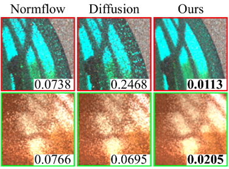
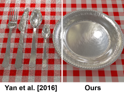
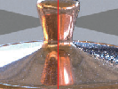
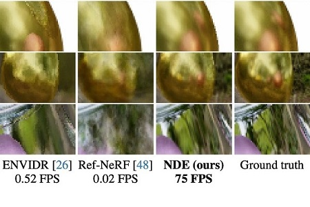
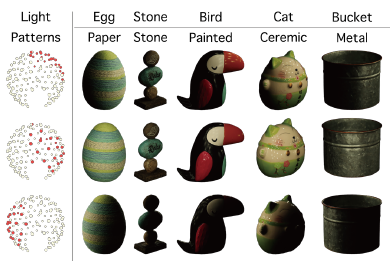
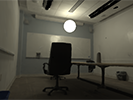
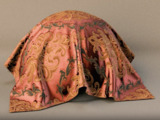
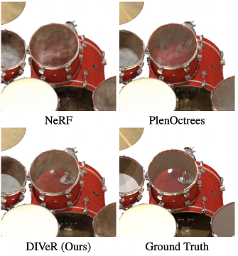

# Liwen Wu

I am a CSE PhD student at UCSD, advised by Professor [Ravi Ramamoorthi](https://cseweb.ucsd.edu/~ravir/). Previously, I obtained my MS and BS degree in CS from UIUC, advised by Professor [David Forsyth](http://luthuli.cs.uiuc.edu/~daf/).

My research lies in the area of computer graphics and 3D vision. Especially, I am interests in neural rendering, inverse rendering, (neural) appearance modeling, and 3D reconstruction.

<nav class="link-buttons" markdown="1">
[Email](mailto:liw026@ucsd.edu){:.button-link}
[Github](https://github.com/lwwu2){:.button-link}
[Scholar](https://scholar.google.com/citations?user=_7OXdUcAAAAJ&hl=en){:.button-link}
[CV](pdfs/CV.pdf){:.button-link}
</nav>

# Publications

<!--
Each publication is written in this strict order:
preview image, title, authors, venue, additional links.
The formatter script below turns these Markdown blocks into the final layout.
-->

### Neural BRDF Importance Sampling by Reparameterization

**Liwen Wu**, [Sai Bi](https://sai-bi.github.io/), [Zexiang Xu](https://zexiangxu.github.io/), [Hao Tan](https://www.cs.unc.edu/~airsplay/), [Kai Zhang](https://kai-46.github.io/website/), [Fujun Luan](https://luanfujun.com/), [Haolin Lu](https://suikasibyl.github.io/), [Ravi Ramamoorthi](https://cseweb.ucsd.edu/~ravir/)

SIGGRAPH 2025

[Paper](https://arxiv.org/pdf/2505.08998)
[Code](https://github.com/lwwu2/reparam25)

### Position-Normal Manifold for Efficient Glint Rendering on High-Resolution Normal Maps

**Liwen Wu**, [Fujun Luan](https://luanfujun.com/), [Miloš Hašan](http://miloshasan.net/), [Ravi Ramamoorthi](https://cseweb.ucsd.edu/~ravir/)

SIGGRAPH 2025

[Paper](https://arxiv.org/pdf/2505.08985)
[Code](https://github.com/lwwu2/glint24)
[Video](https://cseweb.ucsd.edu/~ravir/liwenglint_sig.mp4)

### [BSDF importance sampling using a diffusion model](https://fzy28.github.io/BSDF_diffusion_sampling_web/)

[Ziyang Fu](https://fzy28.github.io/), [Yash Belhe](https://yashbelhe.github.io/), [Haolin Lu](https://suikasibyl.github.io/), **Liwen Wu**, [Bing Xu](https://bingxu.tech/), [Tzu-Mao Li](https://cseweb.ucsd.edu/~tzli/)

SIGGRAPH Asia 2024

[Paper](https://fzy28.github.io/BSDF_diffusion_sampling_web/main.pdf)
[Code](https://github.com/fzy28/BSDF_diffusion_sampling)
[Video](https://drive.google.com/file/d/1wW8FWgaFEi3_meGfGYkTVSm7gNqkLWVG/view?usp=sharing)

### [Neural directional encoding for efficient and accurate view-dependent appearance modeling](https://lwwu2.github.io/nde/)

**Liwen Wu**, [Sai Bi](https://sai-bi.github.io/), [Zexiang Xu](https://zexiangxu.github.io/), [Fujun Luan](https://luanfujun.com/), [Kai Zhang](https://kai-46.github.io/website/), [Iliyan Georgiev](https://iliyan.com/), [Kalyan Sunkavalli](http://www.kalyans.org/), [Ravi Ramamoorthi](https://cseweb.ucsd.edu/~ravir/)

CVPR 2024 (Spotlight)

[Paper](https://arxiv.org/pdf/2405.14847)
[Code](https://github.com/lwwu2/nde)

### [OpenIllumination: A Multi-Illumination Dataset for Inverse Rendering Evaluation on Real Objects](https://oppo-us-research.github.io/OpenIllumination/)

[Isabella Liu](https://www.liuisabella.com/)\*, [Linghao Chen](https://ootts.github.io/)\*, [Ziyang Fu](https://fzy28.github.io/), **Liwen Wu**, [Haian Jin](https://haian-jin.github.io/), [Zhong Li](https://sites.google.com/site/lizhong19900216), Chin Ming Ryan Wong, Yi Xu, [Ravi Ramamoorthi](https://cseweb.ucsd.edu/~ravir/), [Zexiang Xu](https://cseweb.ucsd.edu/~zex014), [Hao Su](http://ai.ucsd.edu/~haosu/)

NeurIPS 2023

[Paper](https://arxiv.org/pdf/2309.07921)
[Code](https://github.com/oppo-us-research/OpenIlluminationCapture)

### [Factorized Inverse Path Tracing for Efficient and Accurate Material-Lighting Estimation](https://jerrypiglet.github.io/fipt-ucsd/)

**Liwen Wu\***, [Rui Zhu\*](https://jerrypiglet.github.io/), [Mustafa B. Yaldiz](https://myaldiz.info/), [Yinhao Zhu](https://yinhaoz.github.io/), [Hong Cai](https://scholar.google.com/citations?user=9y3Kd3cAAAAJ&hl=en), [Janarbek Matai](https://janarbek.github.io/), [Fatih Porikli](https://www.porikli.com/), [Tzu-Mao Li](https://cseweb.ucsd.edu/~tzli/), [Manmohan Chandraker](https://cseweb.ucsd.edu/~mkchandraker/), [Ravi Ramamoorthi](https://cseweb.ucsd.edu/~ravir/)

ICCV 2023 (Oral)

[Paper](https://arxiv.org/pdf/2304.05669)
[Code](https://github.com/lwwu2/fipt)

### [Neusample: Importance Sampling for Neural Materials](https://cseweb.ucsd.edu/~viscomp/projects/neusample/)

[Bing Xu](https://bingxu.tech/), **Liwen Wu**, [Miloš Hašan](http://miloshasan.net/), [Fujun Luan](https://luanfujun.com/), [Iliyan Georgiev](http://iliyan.com/), [Zexiang Xu](https://cseweb.ucsd.edu/~zex014/), [Ravi Ramamoorthi](https://cseweb.ucsd.edu/~ravir/)

SIGGRAPH 2023

[Paper](https://cseweb.ucsd.edu/~viscomp/projects/neusample/assets/NeuSample.pdf)
[Code](https://github.com/bing-xu-graphics/neusample_release)

### [DIVeR: Real-time and Accurate Neural Radiance Fields with Deterministic Integration for Volume Rendering](https://lwwu2.github.io/diver/)

**Liwen Wu**, [Jae Yong Lee](https://jyl.kr/), [Anand Bhattad](https://anandbhattad.github.io/), [Yuxiong Wang](https://yxw.web.illinois.edu/), [David A. Forsyth](http://luthuli.cs.uiuc.edu/~daf/)

CVPR 2022 (Oral) **(Best paper finalist)**

[Paper](https://arxiv.org/pdf/2111.10427)
[Code](https://github.com/lwwu2/diver)

