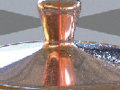
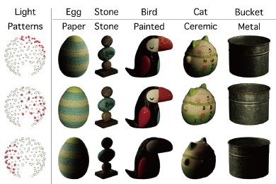
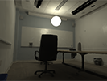
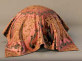
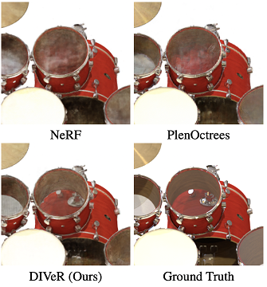

# Liwen Wu

I am a CSE PhD student at UCSD, advised by Professor [Ravi Ramamoorthi](https://cseweb.ucsd.edu/~ravir/). Previously, I obtained my MS and BS degree in CS from UIUC, advised by Professor [David Forsyth](http://luthuli.cs.uiuc.edu/~daf/).

My research lies in the area of computer graphics and 3D vision. Especially, I am interests in neural rendering, inverse rendering, (neural) appearance modeling, and 3D reconstruction.

[Email](liw026@ucsd.edu) / [Github](https://github.com/lwwu2) / [Scholar](https://scholar.google.com/citations?user=_7OXdUcAAAAJ&hl=en)

## Publications

<b><a href="https://fzy28.github.io/BSDF_diffusion_sampling_web/">BSDF importance sampling using a diffusion model</a></b> [Ziyang Fu](https://fzy28.github.io/), [Yash Belhe](https://yashbelhe.github.io/), [Haolin Lu](https://suikasibyl.github.io/), **Liwen Wu**, [Bing Xu](https://bingxu.tech/), [Tzu-Mao Li](https://cseweb.ucsd.edu/~tzli/) SIGGRAPH Asia 2024

\
\
<b><a href="https://lwwu2.github.io/nde/">Neural directional encoding for efficient and accurate view-dependent appearance modeling</a></b> **Liwen Wu**, [Sai Bi](https://sai-bi.github.io/), [Zexiang Xu](https://zexiangxu.github.io/), [Fujun Luan](https://luanfujun.com/), [Kai Zhang](https://kai-46.github.io/website/), [Iliyan Georgiev](https://iliyan.com/), [Kalyan Sunkavalli](http://www.kalyans.org/), [Ravi Ramamoorthi](https://cseweb.ucsd.edu/~ravir/) CVPR 2024 (Spotlight) (Final score 5,5,5)

\
<b><a href="https://oppo-us-research.github.io/OpenIllumination/">OpenIllumination: A Multi-Illumination Dataset for Inverse Rendering Evaluation on Real Objects</a></b> [Isabella Liu](https://www.liuisabella.com/)\*, [Linghao Chen](https://ootts.github.io/)\*, [Ziyang Fu](https://fzy28.github.io/), **Liwen Wu**, [Haian Jin](https://haian-jin.github.io/), [Zhong Li](https://sites.google.com/site/lizhong19900216),
Chin Ming Ryan Wong, Yi Xu, [Ravi Ramamoorthi](https://cseweb.ucsd.edu/~ravir/), [Zexiang Xu](https://cseweb.ucsd.edu/~zex014), [Hao Su](http://ai.ucsd.edu/~haosu/) NeurIPS 2023

\
<b><a href="https://jerrypiglet.github.io/fipt-ucsd/">Factorized Inverse Path Tracing for Efficient and Accurate Material-Lighting Estimation</a></b> **Liwen Wu\***, [Rui Zhu\*](https://jerrypiglet.github.io/), [Mustafa B. Yaldiz](https://myaldiz.info/), [Yinhao Zhu](https://yinhaoz.github.io/), [Hong Cai](https://scholar.google.com/citations?user=9y3Kd3cAAAAJ&hl=en), [Janarbek Matai](https://janarbek.github.io/), [Fatih Porikli](https://www.porikli.com/), [Tzu-Mao Li](https://cseweb.ucsd.edu/~tzli/), [Manmohan Chandraker](https://cseweb.ucsd.edu/~mkchandraker/), [Ravi Ramamoorthi](https://cseweb.ucsd.edu/~ravir/) ICCV 2023 (Oral)

\
<b><a href="https://cseweb.ucsd.edu/~viscomp/projects/neusample/">Neusample: Importance Sampling for Neural Materials</a></b> [Bing Xu](https://bingxu.tech/), **Liwen Wu**, [Miloš Hašan](http://miloshasan.net/), [Fujun Luan](https://luanfujun.com/), [Iliyan Georgiev](http://iliyan.com/), [Zexiang Xu](https://cseweb.ucsd.edu/~zex014/), [Ravi Ramamoorthi](https://cseweb.ucsd.edu/~ravir/) SIGGRAPH 2023

\
\
<b><a href="https://lwwu2.github.io/diver/">DIVeR: Real-time and Accurate Neural Radiance Fields with Deterministic Integration for Volume Rendering</a></b> **Liwen Wu**, [Jae Yong Lee](https://jyl.kr/), [Anand Bhattad](https://anandbhattad.github.io/), [Yuxiong Wang](https://yxw.web.illinois.edu/), [David A. Forsyth](http://luthuli.cs.uiuc.edu/~daf/) CVPR 2022 (Oral) **(Best paper finalist)**
